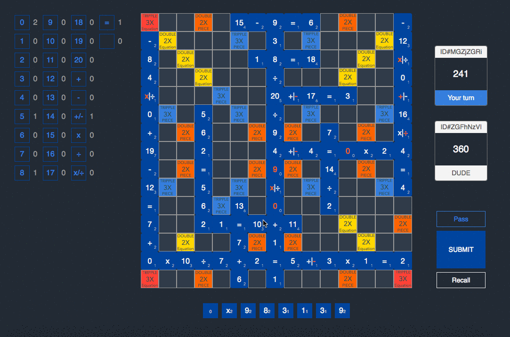

# A-MATH

So you want to play game? Go for it :) https://amath.morphism.io/

### Equipments

1. Board: 225 slots (15 x 15)
    - Triple Equation 3X
    - Double Equation 2X
    - Triple Piece 3X
    - Double Piece 2X

2. Tiles: 100 ea

      tile | ea | point | | tile | ea | point | | tile | ea | point
      :--: |:--:| :---: |-| :--: |:--:| :---: |-| :--: |:--:| :---:
      0    | 5  | 1     | | 10   | 2  | 3     | | 20   | 1  | 5
      1    | 6  | 1     | | 11   | 1  | 4     | | (+)  | 4  | 2
      2    | 6  | 1     | | 12   | 2  | 3     | | (-)  | 4  | 2
      3    | 5  | 1     | | 13   | 1  | 6     | | (+/-)| 5  | 1
      4    | 5  | 2     | | 14   | 1  | 4     | | (x)  | 4  | 2
      5    | 4  | 2     | | 15   | 1  | 4     | | (÷)  | 4  | 2
      6    | 4  | 2     | | 16   | 1  | 4     | | (x/÷)| 4  | 1
      7    | 4  | 2     | | 17   | 1  | 6     | | (=)  | 11 | 1
      8    | 4  | 2     | | 18   | 1  | 4     | | Blank| 4  | 0
      9    | 4  | 2     | | 19   | 1  | 7     | |      |    |
### LICENSE
[MIT License](LICENSE)
